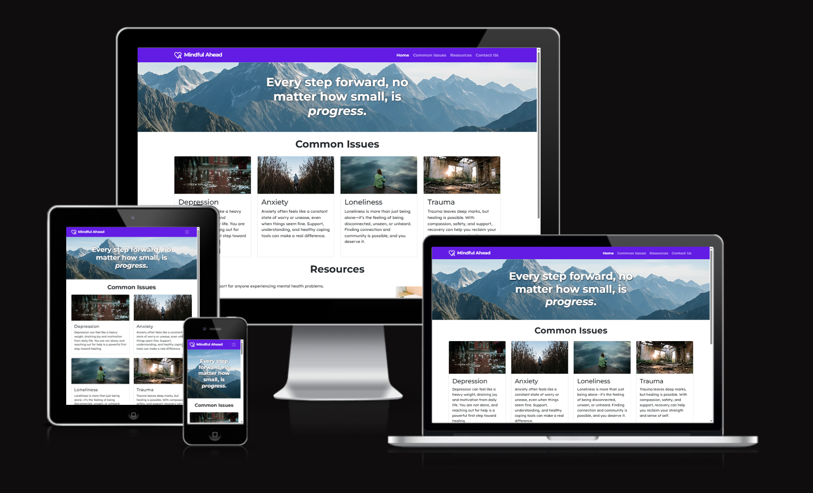
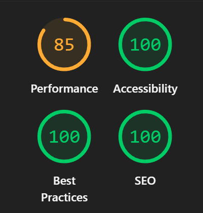

# Mindful Ahead

## Purpose

Mindful Ahead is a one-page web application aiming to provide basic mental health information, bringing awareness and understanding to these issues.

## User Value

This website offers easily understandable information to any user, from those that understand nothing about mental health to those with existing knowledge. The resources given help the user find other sites that can better help them in more focused areas.

## Responsiveness

My website responds to the typical breakpoints for phones, laptops, and large screens.

## Performance

With a score of 85 in performance (calculated using Lighthouse), I believe there is a lot to improve. I would've imported only a couple of the font-weights instead of all of them to quicken page load times.

## Validation

My website passes validation for both HTML and CSS. Websites used:

- https://validator.w3.org/
- https://jigsaw.w3.org/css-validator/

## Credits

The website's logo and hero image (mountains) were both generated by ChatGPT. The images used for the common issues section and resources were sourced from [Pexels](https://www.pexels.com).

In terms of external libraries, the website makes use of Bootstrap, Font Awesome, and two Google Fonts.

ChatGPT/Copilot was also used throughout the website's creation, helping to fix errors or give advice. Notably, AI played the biggest role when creating the Resources section.

## Deployment Procedure

This web application is hosted on GitHub and is deployed via GitHub Pages at [Mindful Ahead](https://etcocoa.github.io/mindful-ahead/).
